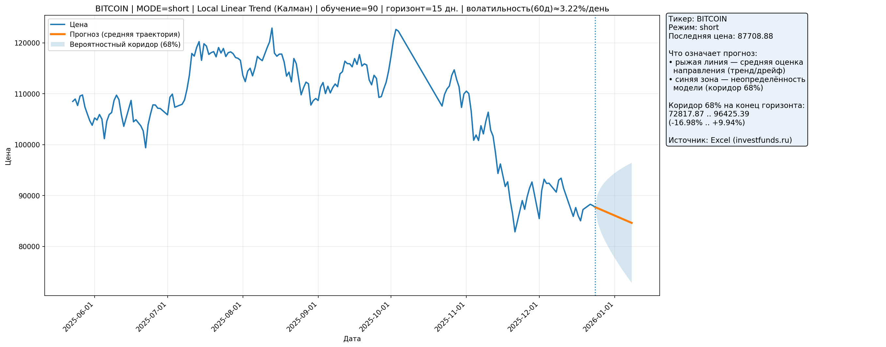

# Investfunds Local Trend Forecast (Kalman / State Space)

Скрипт берёт **дневные цены** по инструментам (**акции и криптовалюты**) из Excel-выгрузки **investfunds**, очищает данные и строит прогноз с помощью модели **Kalman / State Space**: Local Linear Trend (statsmodels).  
На выходе — график с прогнозной траекторией и вероятностным коридором.

> Excel-файлы с исходными данными **не коммитятся** (data/raw/*.xlsx в .gitignore).

---

## Быстрый старт

### 1) Установка зависимостей
В терминале:
    pip install -r requirements.txt

### 2) Подготовка данных
1. Скачай Excel с investfunds с историей цен **за 5+ лет** (акция или криптовалюта).
2. Положи файл в папку:
    data/raw/

Скрипт автоматически возьмёт **последний по времени изменения** .xlsx из data/raw/.

### 3) Запуск
В терминале:
    python src/main.py

---

## Что делает скрипт

### Источник данных
- investfunds (Excel-выгрузки)
- инструменты: акции / криптовалюты
- частота: дневные цены

### Требования к данным (почему 5+ лет)
- модель тренда устойчивее оценивает уровень/дрейф на длинной истории
- меньше риск “переобучения” на коротком участке
- прогнозный коридор обычно получается более адекватным

### Обработка данных (ETL)
Скрипт автоматически:
- находит колонку даты и цены (разные варианты названий)
- приводит даты к datetime
- парсит цену в число (учитывает пробелы/запятые/форматы)
- удаляет пустые значения и дубликаты дат
- сортирует по времени
- определяет календарь (торговые дни/календарные дни) по разрывам в датах

### Модель и прогноз
- модель: UnobservedComponents(level="local linear trend")
- режимы в коде: short / medium / long (разные окна обучения и горизонты)
- строится:
  - средняя прогнозная траектория
  - доверительный коридор 68%

### Отчёт и визуализация
- сохраняет итоговый график: reports/forecast.png
- на графике:
  - линия цены (история)
  - средняя прогнозная траектория
  - полоса неопределённости (68%)
- в консоль выводится summary:
  - диагностическая информация по данным
  - волатильность (лог-доходности)
  - диапазон прогноза в % к последней цене

---

## Пример результата

---

## Структура проекта
    investfunds-local-trend/
    ├─ src/
    │  └─ main.py
    ├─ data/
    │  └─ raw/              # сюда кладутся .xlsx (не коммитятся)
    ├─ reports/
    │  └─ forecast.png      # пример результата
    ├─ README.md
    ├─ requirements.txt
    └─ .gitignore

---

## Ограничения
- Учебный/прикладной проект, **не инвестиционная рекомендация**
- Модель описывает тренд и неопределённость на основе истории, но **не учитывает новости/события** напрямую
